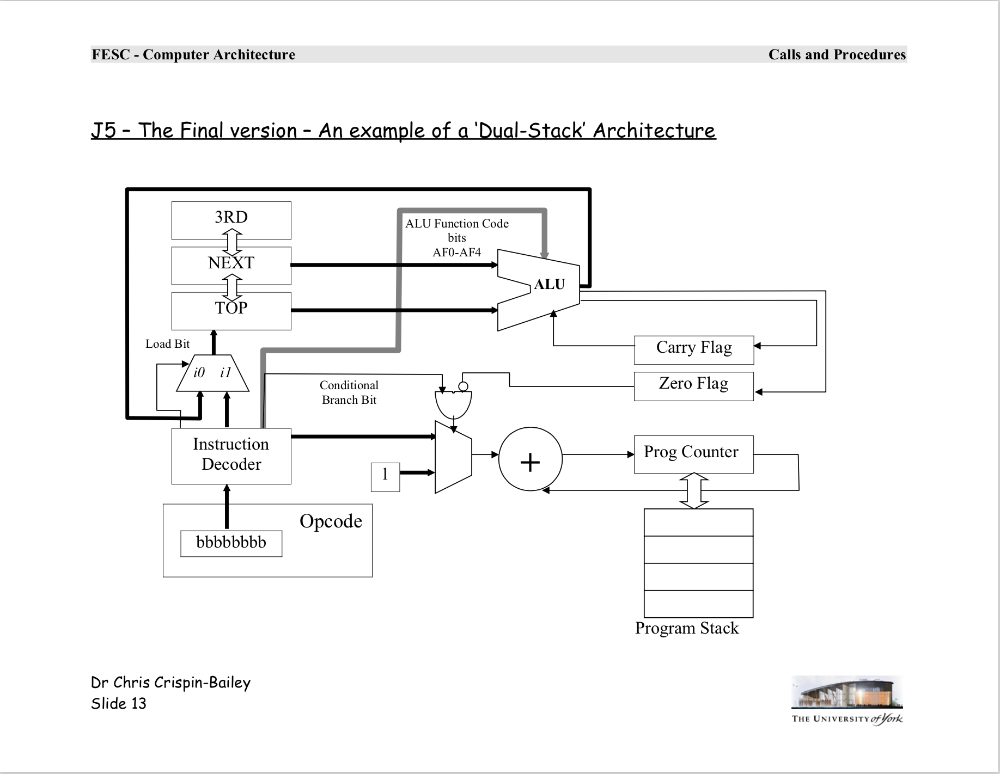

# Jorvik-5 Simulator
This will be a simulator for the Jorvik-5 (J5) architecture, created for my final year project for my degree in 
Computer Science at the University of York.

The J5 processor is defined in the lectures for one of the modules on UoY Computer Science. The instruction set is
not fully defined and my simulator will deviate from the instructions to make it more complete and more suitable for 
translation with the PicoBlaze machine.

The circuit diagram for the J5 processor that my design is based on is here:

## Modifications to the design
A list of the modifications to the standard architecture I have made is as follows:
* Stack width is 8 bit instead of 16 bit
    * The SET statement has been removed because of this (the SSET statement remains)
* Add FETCH and STORE instructions for Scratch Pad Memory
